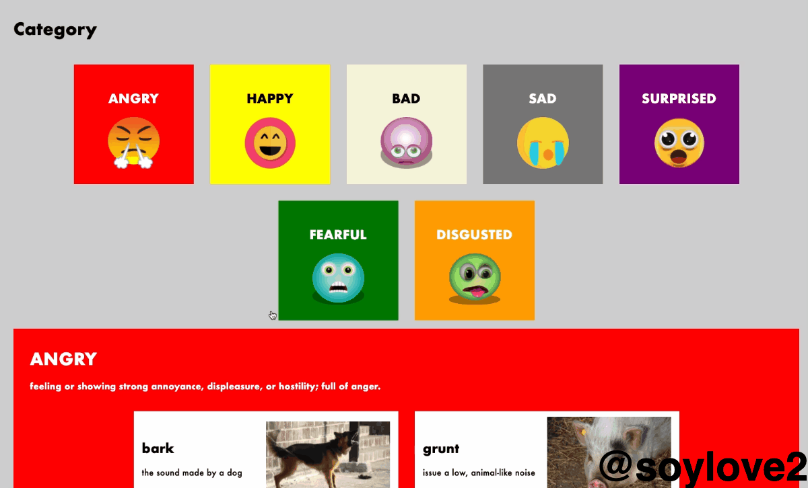

# Emotion Onomatopoeia Dictionary - Project 1 (second)
from [Recursion](https://recursionist.io)

## Description
感情を表現するカードをクリックすると、その擬音カードのセクションへジャンプする。

文字列キーとEmotionObjectのハッシュマップ、連想配列である辞書（単語：説明）、写真用辞書（単語：PicURL）を使用して効率的にレンダリングするプロジェクト。

## Demo

## Author
[@soylove2](https://twitter.com/soylove2)
